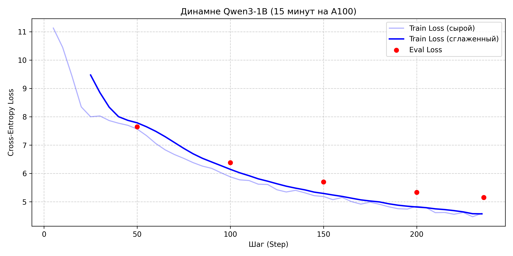

# Эксперимент: Мини-претрейн LLM (Qwen3 1B) с нуля

Делаем претрейн Qwen3 (1 млрд параметров) на текстах русской Википедии за фиксированное время (15 минут) на 1 GPU NVIDIA A100 80GB.

## Сетап и конфигурация
* GPU: 1x NVIDIA A100 80GB SXM/PCIe.
* Модель: Qwen3-1B (12 слоев, hidden=2048, FlashAttention-2, BF16).
* Токенизатор: `ai-forever/rugpt3small_based_on_gpt2` (vocab ~50k).
* Контекст: 512 токенов.
* Датасет: `wikimedia/wikipedia` (русский срез).

## Результаты Run 1 (Базовый прогон)
* Стартовый Loss: ~11.1 (теоретический предел для случайных весов $\ln(50257) \approx 10.8$).
* Финальный Loss: ~4.8.
* График обучения:

## Качественный анализ генераций
На старте модель выдавала несвязный набор байтов. К 15-й минуте:
* Модель выучила базовую структуру русского языка: пробелы, знаки препинания, заглавные буквы.
* Появились устойчивые конструкции из Википедии («... — это ...», «родился в ... году»).
* Семантическая связность на длинном контексте пока слабая — 15 минут хватает только на первичную постановку синтаксиса и морфологии.

## Главные выводы по оптимизации
1. FlashAttention-2 + BF16 пока оставим, обучать 1B модель без чекпоинтинга.
2. Проблема частого евала: промежуточный `eval` каждые 50 шагов отнимал по 40 секунд на прогон 5000 семплов валидации, суммарно съев ~20% доступного времени. Эвалить лучше в конце 15-минутного окна.
3. Torch Compile: на ультракоротких сессиях не имеет смысла из-за долгой компиляции первого шага
